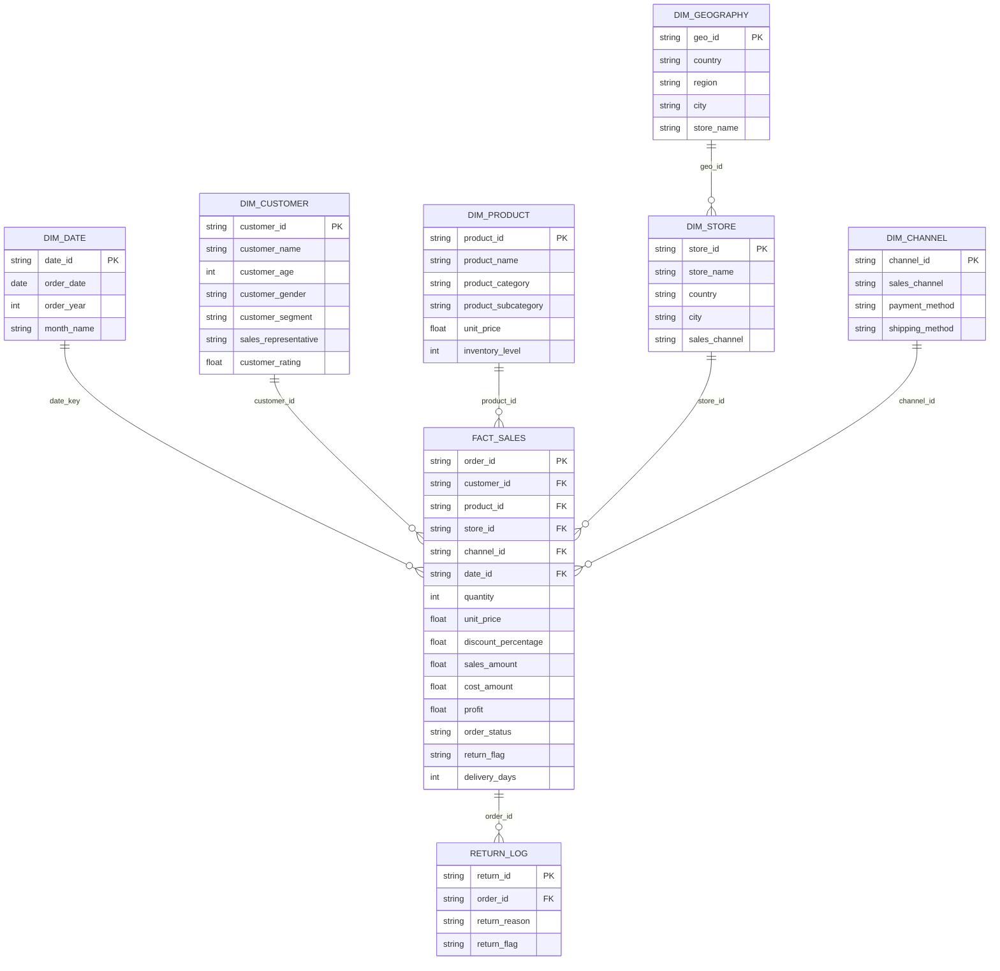
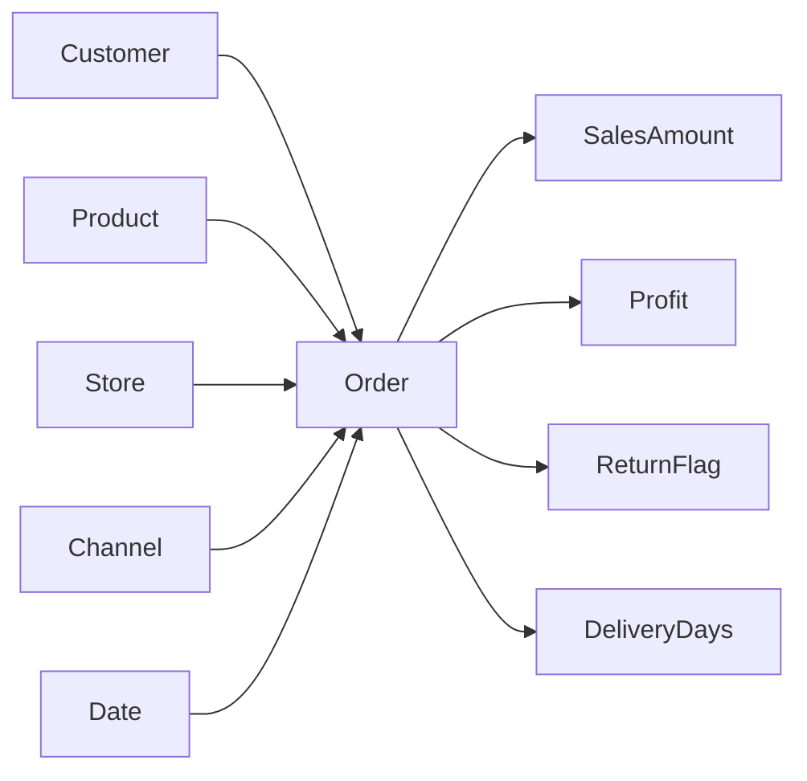

# Retail Sales Analytics Dashboard

This project is a retail analytics and business intelligence dashboard built with Python and Streamlit. It helps analyze sales performance, profit trends, customer behavior, product performance, and operational risk across multiple regions, channels, and product categories.

The dashboard is designed for decision-makers who want a quick view of:

- revenue and profit trends over time
- best-performing products and categories
- customer segments and demographic patterns
- geography and sales-channel performance
- return and delivery risk indicators
- profitability and order quality by sales rep and business segment

## Project overview

The project uses a cleaned retail sales dataset spanning 2022 to 2025. It combines transactional, product, customer, and operational information into a single analytical dataset, making it suitable for trend analysis, KPI monitoring, and business reporting.

The application includes multiple pages such as:

- Overview
- Sales Insights
- Products
- Risk and Team
- KPI dashboard views

## Business value

This dashboard helps answer practical business questions such as:

- Which product categories drive the highest revenue and profit?
- Which sales channels perform best by region and year?
- Are return rates or delivery delays increasing over time?
- Which products are most profitable or least profitable?
- How do customer segments and age groups influence sales?
- Which markets and cities generate the strongest results?

## Dataset description

The data source is a retail transaction dataset stored in the project as a cleaned CSV file. Each row represents a sales order or transaction detail and includes customer, product, location, payment, logistics, and performance attributes.

Key fields include:

- Transaction and order identifiers
- Customer demographics and segmentation
- Product and category details
- Quantity, unit price, discount, sales, cost, and profit
- Order status, return flag, and delivery details
- Store, region, country, and city
- Sales channel and payment method
- Rating, inventory, and sales year

## Logical database schema

Although the project uses a flattened CSV for analysis, the underlying data model can be represented as a retail warehouse schema with a fact table and supporting dimensions.



### Schema interpretation for this project

The CSV data maps closely to the following normalized design:

- Fact table: sales transaction records
  - order, customer, store, product, date, channel, and financial metrics
- Customer dimension: customer identifiers, names, age, gender, segment, and rating
- Product dimension: product names, category, subcategory, price, and inventory level
- Location dimension: region, country, city, and store information
- Date dimension: order date, month, and year
- Channel dimension: sales channel, payment method, and shipping method
- Return dimension: return status and reason

## Conceptual relationship view



This model shows the relationship between core business entities and the transactional facts used to calculate sales and profitability.

## Project structure

```text
Retail-Project/
├── app.py
├── cleaned_data.csv
├── cleaned_data.parquet
├── requirements.txt
├── utils.py
├── Database/
│   └── Sales_transactions_2022_2025.csv
├── pages/
│   ├── Overview.py
│   ├── KPI .py
│   ├── Sales_Insights.py
│   ├── Products.py
│   └── Risk_and_Team.py
├── assets/
├── .streamlit/
└── Retail_Project.ipynb
```

## Tech stack

- Python
- Streamlit
- Pandas
- Plotly
- NumPy
- Statsmodels
- PyArrow

## Setup and usage

1. Clone the repository.
2. Navigate to the project directory.
3. Create a virtual environment if needed.
4. Install dependencies:

```bash
pip install -r requirements.txt
```

5. Run the dashboard:

```bash
streamlit run app.py
```

## Dashboard highlights

The app provides quick analytical views for:

- total sales, profit, and profit margin
- sales by year, month, country, and city
- customer segmentation and demographic trends
- product profitability and Pareto analysis
- return rate and operational risk tracking
- sales rep and channel performance

## Notes

- The original raw dataset is cleaned and prepared before analysis.
- Some columns are derived for reporting convenience, such as order year and month name.
- The project is structured for business intelligence exploration rather than full transactional database deployment.

## Summary

This project delivers a practical retail analytics experience by combining a realistic sales dataset with an interactive dashboard. It demonstrates how retail data can be modeled, cleaned, explored, and visualized to uncover key business trends and operational insights.
